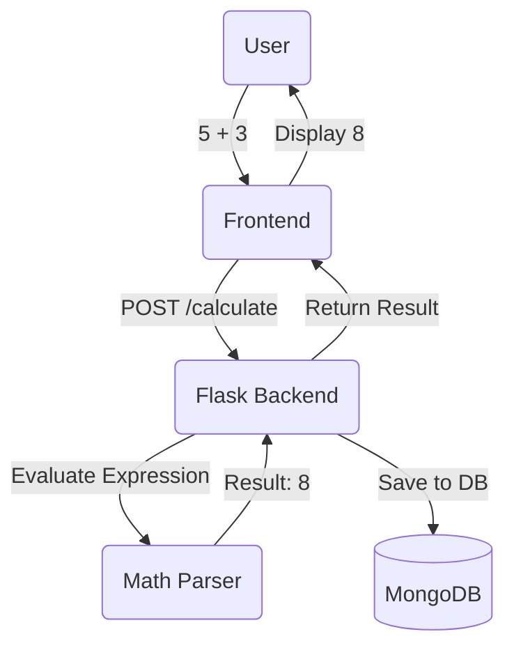

# Web Calculator with User Authentication

A feature-rich web calculator application built with Flask and MongoDB, featuring user authentication, calculation history, and advanced mathematical operations.

## Features

### Calculator Functions
- Basic arithmetic operations (+, -, *, /)
- Scientific operations:
  - Square root (√)
  - Square (x²)
  - Reciprocal (1/x)
  - Logarithm (log)
  - Natural logarithm (ln)
  - Trigonometric functions (sin, cos, tan)
  - Inverse trigonometric functions (asin, acos, atan)

### User Management
- User registration with email verification
- Secure login system
- Password reset functionality with OTP
- Session management

### Calculation History
- Save calculations automatically
- View calculation history
- Sort calculations by:
  - Date (newest/oldest first)
  - Result (highest/lowest)
- Delete individual calculations
- User-specific history

## Technology Stack

- **Frontend**: HTML, CSS, JavaScript
- **Backend**: Python Flask
- **Database**: MongoDB
- **Authentication**: Flask-Login
- **Email Service**: Flask-Mail
- **Password Hashing**: bcrypt
- **Token Management**: PyJWT

## System Architecture



## Prerequisites

- Python 3.x
- MongoDB
- SMTP server access for email functionality

## Environment Variables

Create a `.env` file in the root directory with the following variables:
```
MONGODB_URI=your_mongodb_connection_string
EMAIL_USER=your_email_address
EMAIL_PASSWORD=your_email_password
```

### Setting Up Email for OTP Verification

This application uses Gmail SMTP to send OTP (One-Time Password) codes for email verification and password reset. Follow these steps to configure your email:

#### Step 1: Enable 2-Factor Authentication (2FA) on Gmail

1. Go to your [Google Account Security](https://myaccount.google.com/security)
2. Under "Signing in to Google", click **2-Step Verification**
3. Follow the prompts to enable 2FA (you'll need to verify your phone number)

#### Step 2: Generate an App Password

1. After enabling 2FA, go back to [Google Account Security](https://myaccount.google.com/security)
2. Under "Signing in to Google", click **App passwords**
3. You may need to sign in again
4. Select **Mail** as the app and **Other (Custom name)** as the device
5. Enter a name like "Calculator App" and click **Generate**
6. **Copy the 16-character password** (you won't be able to see it again)

#### Step 3: Configure Your .env File

1. Create a `.env` file in the project root directory (if it doesn't exist)
2. Add your email credentials:
   ```
   EMAIL_USER=your-email@gmail.com
   EMAIL_PASSWORD=your-16-character-app-password
   ```
   - **EMAIL_USER**: Your Gmail address (e.g., `yourname@gmail.com`)
   - **EMAIL_PASSWORD**: The 16-character app password you generated (no spaces)

#### Alternative: Using Other Email Providers

If you want to use a different email provider (not Gmail), you'll need to modify the email configuration in `app.py`:

- **Outlook/Hotmail**: 
  - `MAIL_SERVER = 'smtp-mail.outlook.com'`
  - `MAIL_PORT = 587`
- **Yahoo**: 
  - `MAIL_SERVER = 'smtp.mail.yahoo.com'`
  - `MAIL_PORT = 587`
- **Custom SMTP**: Update `MAIL_SERVER` and `MAIL_PORT` accordingly

**Note**: For non-Gmail providers, you may need to use your regular email password or generate an app-specific password from your email provider's settings.

## Installation

1. Clone the repository:
```bash
git clone <repository-url>
cd calculator
```

2. Install required packages:
```bash
pip install -r requirements.txt
```

3. Set up MongoDB:
- Install MongoDB if not already installed
- Create a new database named 'calculator_db'

4. Start the application:
```bash
python app.py
```

The application will be available at `http://localhost:5000`

## How to Use This Project

### Initial Setup

1. **Start MongoDB**: Ensure MongoDB is running on your system
   ```bash
   # On Windows (if installed as service, it should start automatically)
   # On Linux/Mac:
   sudo systemctl start mongod
   # Or:
   mongod
   ```

2. **Verify MongoDB Connection**: The application will automatically connect to MongoDB. Check the console for "Successfully connected to MongoDB" message.

3. **Start the Flask Application**:
   ```bash
   python app.py
   ```

4. **Access the Application**: Open your browser and navigate to `http://localhost:5000`

### User Registration and Email Verification

1. **Register a New Account**:
   - Click on "Register" or navigate to the registration page
   - Fill in the required fields:
     - **Username**: Must start with a letter or number, be at least 4 characters long, and contain only letters, numbers, and underscores
     - **Email**: A valid email address (this will be used for OTP verification)
     - **Password**: Between 6 and 14 characters
   - Click "Register"

2. **Verify Your Email**:
   - After registration, you'll receive an OTP (6-digit code) via email
   - Check your email inbox (and spam folder if needed)
   - Enter the OTP code on the verification page
   - Click "Verify"
   - **Note**: OTP codes expire after 5 minutes

3. **Login**:
   - After successful verification, you'll be redirected to the login page
   - Enter your username and password
   - Click "Login"
   - You'll be taken to the calculator interface

### Using the Calculator

1. **Basic Operations**:
   - Click number buttons (0-9) to enter numbers
   - Use operation buttons: `+`, `-`, `×`, `÷`
   - Click `=` to calculate the result
   - Use `C` to clear the current input
   - Use `AC` to clear all

2. **Scientific Functions**:
   - **Square Root (√)**: Calculates the square root of the current number
   - **Square (x²)**: Squares the current number
   - **Reciprocal (1/x)**: Calculates 1 divided by the current number
   - **Logarithm (log)**: Base 10 logarithm
   - **Natural Logarithm (ln)**: Natural logarithm (base e)
   - **Trigonometric Functions**: `sin`, `cos`, `tan` (input in degrees)
   - **Inverse Trigonometric**: `asin`, `acos`, `atan` (result in degrees)

3. **Saving Calculations**:
   - After performing a calculation, it's automatically saved to your history
   - You can optionally name your calculation before saving
   - All calculations are linked to your user account

### Viewing Calculation History

1. **Access History**:
   - Click on "History" in the navigation menu
   - View all your saved calculations

2. **Sorting Options**:
   - **Date (Newest First)**: Default view, shows most recent calculations first
   - **Date (Oldest First)**: Shows oldest calculations first
   - **Result (Highest First)**: Sorts by calculation result, highest to lowest
   - **Result (Lowest First)**: Sorts by calculation result, lowest to highest

3. **Managing History**:
   - Click the delete button (🗑️) next to any calculation to remove it
   - Deletions are permanent and cannot be undone

### Password Reset

If you forget your password:

1. **Request Password Reset**:
   - On the login page, click "Forgot Password?"
   - Enter your registered email address
   - Click "Send Reset Code"

2. **Verify OTP**:
   - Check your email for the 6-digit OTP code
   - Enter the code on the verification page
   - Click "Verify"

3. **Set New Password**:
   - After OTP verification, you'll be prompted to enter a new password
   - Enter your new password (6-14 characters)
   - Confirm and click "Reset Password"
   - You can now login with your new password

### Troubleshooting

**Email Not Received?**
- Check your spam/junk folder
- Verify that `EMAIL_USER` and `EMAIL_PASSWORD` in `.env` are correct
- Ensure you're using an App Password (not your regular Gmail password)
- Check that 2FA is enabled on your Google account
- Verify your internet connection

**MongoDB Connection Issues?**
- Ensure MongoDB is installed and running
- Check that the `MONGODB_URI` in `.env` is correct
- For local MongoDB, use: `mongodb://localhost:27017/`
- Verify MongoDB is accessible on port 27017

**OTP Expired?**
- OTP codes expire after 5 minutes
- Request a new OTP by registering again or requesting a new password reset

**Login Issues?**
- Ensure your email is verified (check your email for the verification code)
- Verify your username and password are correct
- Try resetting your password if you've forgotten it

## Security Features

- Password hashing using bcrypt
- Email verification for new accounts
- OTP-based password reset
- Session management
- Protected API endpoints
- Input validation and sanitization

## Database Collections

### Users Collection
- _id: ObjectId
- username: string
- password: hashed string
- email: string
- verified: boolean

### Calculations Collection
- _id: ObjectId
- user_id: ObjectId
- name: string
- expression: string
- result: float
- timestamp: datetime

### OTP Collection
- _id: ObjectId
- email: string
- otp: string
- created_at: datetime
- for_password_reset: boolean

## API Endpoints

- `/register` - User registration
- `/verify-email` - Email verification
- `/login` - User login
- `/logout` - User logout
- `/forgot-password` - Password reset initiation
- `/reset-password` - Password reset completion
- `/calculate` - Perform calculations
- `/history` - View calculation history
- `/delete-calculation/<id>` - Delete specific calculation

## Contributing

1. Fork the repository
2. Create your feature branch (`git checkout -b feature/AmazingFeature`)
3. Commit your changes (`git commit -m 'Add some AmazingFeature'`)
4. Push to the branch (`git push origin feature/AmazingFeature`)
5. Open a Pull Request

## License

This project is licensed under the MIT License - see the LICENSE file for details.

## Acknowledgments

- Flask documentation
- MongoDB documentation
- Python math library
- Flask-Login documentation 
